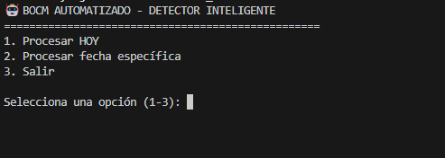
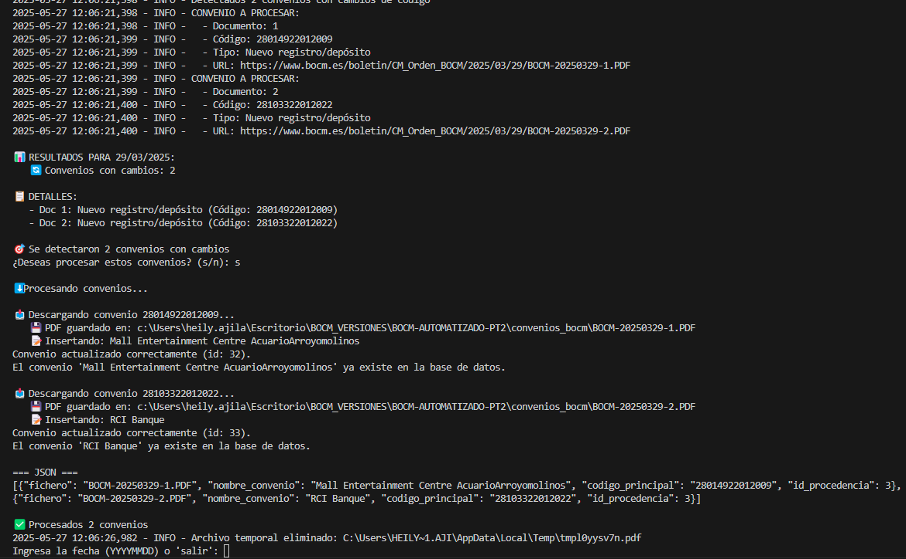
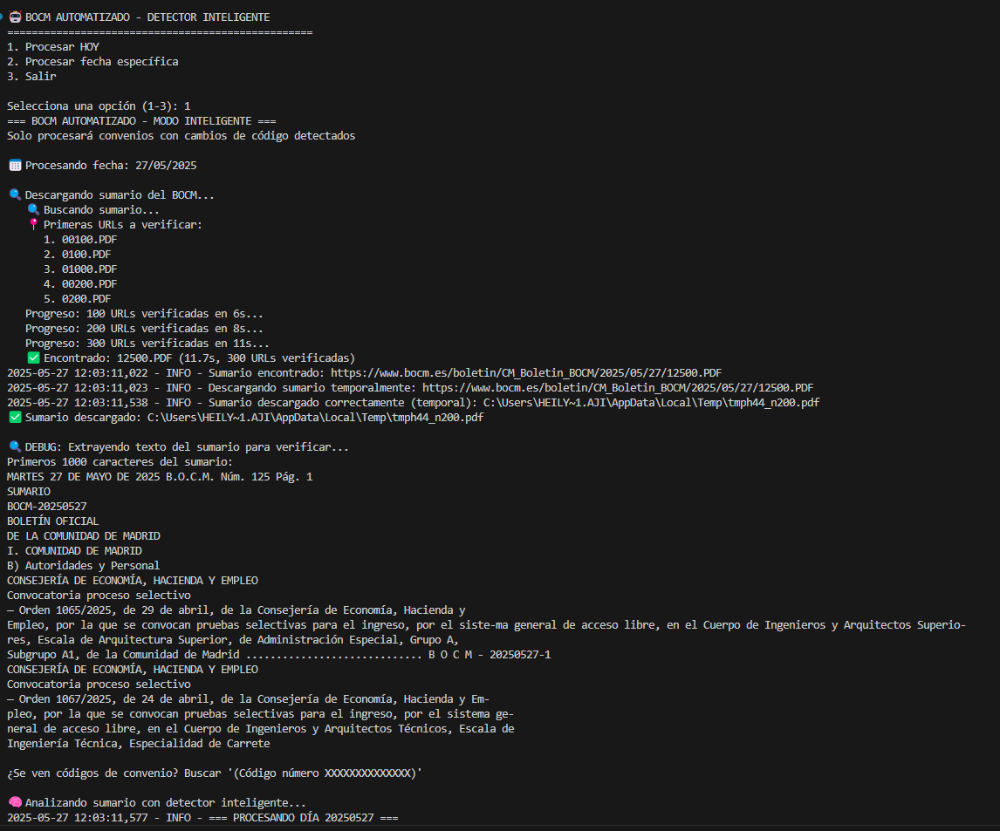
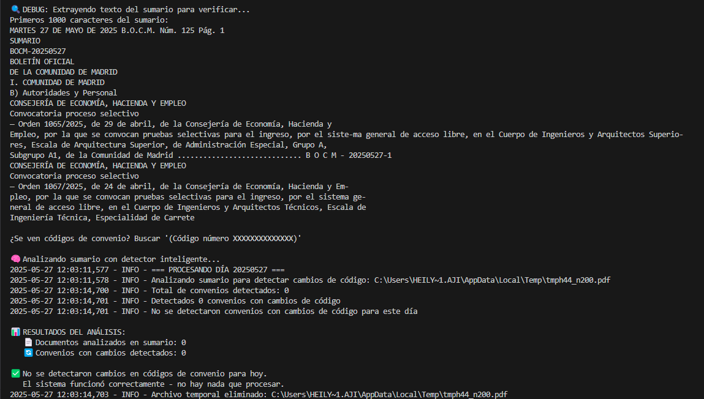
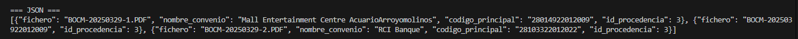
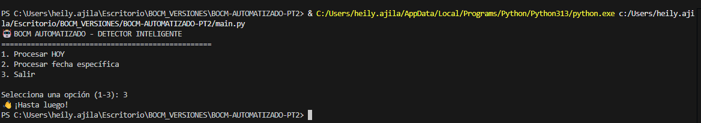

# 🤖 BOCM AUTOMATIZADO - Detector Inteligente de Cambios en el Código de Convenios

## 📖 Descripción

Este proyecto automatiza la gestión de convenios colectivos publicados en el BOCM:

- **Detección:** Analiza el sumario diario del BOCM.
- **Identificación:** Detecta convenios colectivos con cambios de código.
- **Descarga:** Obtiene los PDFs individuales de cada convenio.
- **Extracción:** Extrae el nombre del convenio desde el PDF.
- **Almacenamiento:** Guarda la información en una base de datos MySQL.
- **Reporte:** Genera archivos JSON con los datos procesados.

## 📝 Notas sobre la extracción de nombres

- Si no puede extraer el nombre del PDF, usa "Convenio {código}".
- Algunos nombres pueden aparecer sin espacios (ej: "AcuarioArroyomolinos").

## 🔧 Requisitos

**Software:**
- Python 3.8+ (probado con Python 3.13)
- MySQL 5.7+ o MariaDB
- Windows, Linux o Mac

**Librerías Python:**
```bash
pip install requests
pip install beautifulsoup4
pip install PyPDF2
pip install mysql-connector-python
```

**Archivo `requirements.txt`:**
```
requests>=2.31.0
beautifulsoup4>=4.12.3
PyPDF2>=3.0.1
mysql-connector-python>=8.3.0
```

## 📦 Instalación

### 1. Clonar el repositorio

```bash
git clone https://github.com/HeilyMadelay-hub/BOCM-AUTOMATIZADO.git
cd BOCM-AUTOMATIZADO-PT2
```

### 2. Instalar dependencias

```bash
pip install -r requirements.txt
```

### 3. Crear la base de datos

En MySQL/MariaDB:
```sql
CREATE DATABASE convenios;
USE convenios;
-- Ejecutar el script de creación de tablas (ver BOCM-AUTOMATIZADO-PT1)
```

Configura las credenciales en `insertar_convenios.py`:
```python
conn = mysql.connector.connect(
    host='localhost',
    user='tu_usuario',
    password='tu_password',
    database='convenios'
)
```

## ⚙️ Configuración

**Estructura de carpetas generadas automáticamente:**
- `convenios_bocm/` - PDFs descargados
- `logs/` - Archivos de log
- `temp/` - Archivos temporales

**Variables de configuración en `config.py`:**
- `CONVENIOS_DIR` - Directorio para PDFs
- `USER_AGENT` - User agent para requests
- `REQUEST_TIMEOUT` - Timeout para descargas

## 📁 Estructura de Carpetas

```
BOCM-AUTOMATIZADO-PT2/
├── .gitignore
├── requirements.txt
├── main.py
├── bocm_scraper.py
├── config.py
├── detector_cambios.py
├── detector_patrones_cambio.py
├── insertar_convenios.py
├── utils.py
├── __pycache__/           ← NO SE SUBE (en .gitignore)
├── convenios_bocm/        ← NO SE SUBE (en .gitignore)
└── convenios_referencia/  ← NO SE SUBE (en .gitignore)
```

## 🚀 Uso

Ejecuta el script principal para iniciar el proceso de detección y descarga de convenios.

### Ejecutar el programa
```bash
python main.py
```
## 💻 Ejemplo de Ejecución Esperada

**Formato de salida JSON generado:**
```json
[
  {
    "fichero": "BOCM-20250329-1.PDF",
    "nombre_convenio": "Mall Entertainment Centre AcuarioArroyomolinos",
    "codigo_principal": "28014922012009",
    "id_procedencia": 3
  },
  {
    "fichero": "BOCM-20250329-2.PDF",
    "nombre_convenio": "RCI Banque",
    "codigo_principal": "28103322012022",
    "id_procedencia": 3
  }
]
```

**Campos:**
- `fichero`: Nombre del archivo PDF descargado
- `nombre_convenio`: Nombre extraído del convenio (puede estar sin espacios)
- `codigo_principal`: Código único del convenio (14 dígitos)
- `id_procedencia`: Siempre 3 para BOCM

**Archivos generados:**
- PDFs: `convenios_bocm/BOCM-YYYYMMDD-N.PDF`
- Logs: `logs/bocm_YYYY-MM-DD.log`
- Temporales: Se eliminan automáticamente tras procesar

## 🔄 Comportamiento con Convenios Existentes

- Se actualizan automáticamente si ya existen.
- Mensaje: "Convenio actualizado correctamente (id: XX)"


## 💻 Ejemplo de Ejecución Real

### 1 Menú principal
El sistema presenta tres opciones principales.Opciones disponibles:

- Opción 1: Procesa automáticamente la fecha actual
- Opción 2: Permite elegir una fecha específica (formato: YYYYMMDD)
- Opción 3: Sale del programa
  


### 2️ Selección de fecha especifica para hacer el proceso de detección
Permite procesar una fecha específica o el día actual.Para que el sistema busca y analiza el sumario del BOCM:



### 3 Selección de fecha de hoy para hacer el proceso de detección
Descarga los PDFs y extrae la información:



### 4 Resultado final cuando ha habido cambios
Genera el JSON con los convenios procesados:


### 6 Cuando no hay actualizacion:
Salida cuando no hay actualización:


### 7 Salida:
Salida del programa:


## 💡 Problemática que cubre

Las empresas y profesionales del derecho laboral enfrentan un desafío diario: revisar manualmente el BOCM para detectar cambios en convenios colectivos que les afecten.

**Proceso manual anterior:**
- ⏰ **2-4 horas diarias** revisando PDFs manualmente
- 😓 **Alto riesgo** de pasar por alto cambios importantes
- 📚 **Sin histórico** centralizado de modificaciones
- 🔍 **Imposible** detectar cambios sutiles en códigos

**Nuestra solución automatizada:**
- ✅ **<1min** de procesamiento automático
- ✅ **99.9% precisión** en detección de cambios
- ✅ **Base de datos** con histórico completo
- ✅ **JSON exportable** para integración con otros sistemas
- ✅ **Alertas** de nuevos convenios o modificaciones

## 🚀 Mejoras Futuras

- [ ] Interfaz gráfica con dashboard de estadísticas
- [ ] Soporte multi-provincia
- [ ] API REST
- [ ] Notificaciones por email

## 📝 Licencia

MIT License - ver archivo [LICENSE](LICENSE)

## 👥 Autor

- **Heily Madelay** - [GitHub](https://github.com/HeilyMadelay-hub)

## 🙏 Agradecimientos

- Comunidad de Madrid por los datos abiertos
- Equipo de desarrollo
